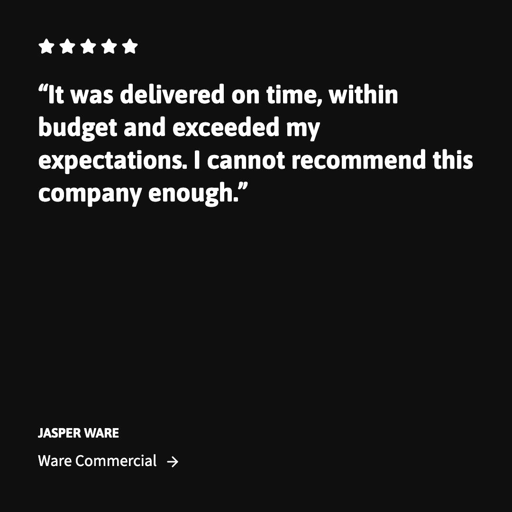
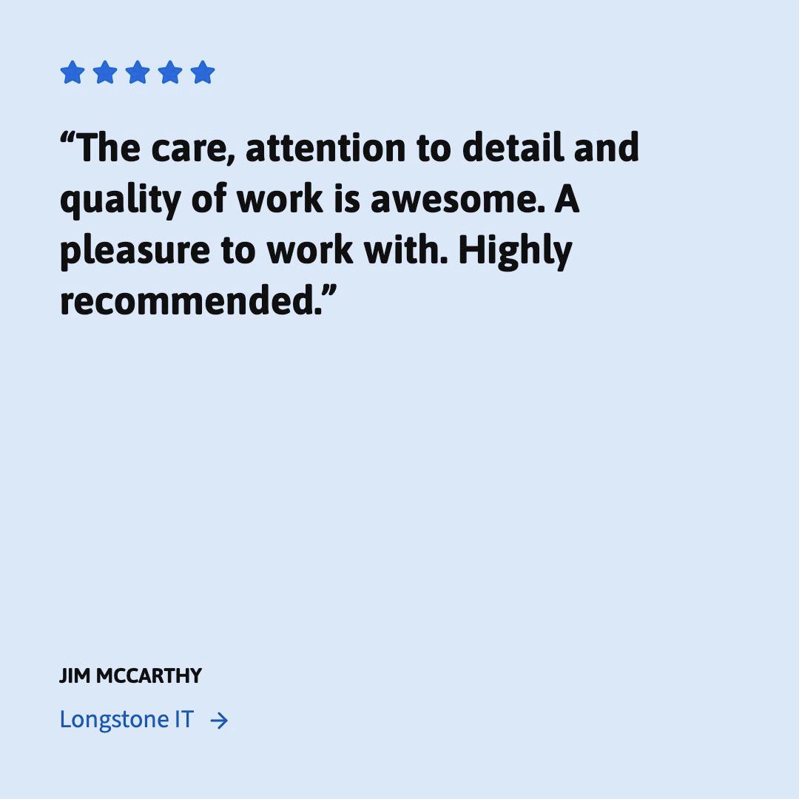
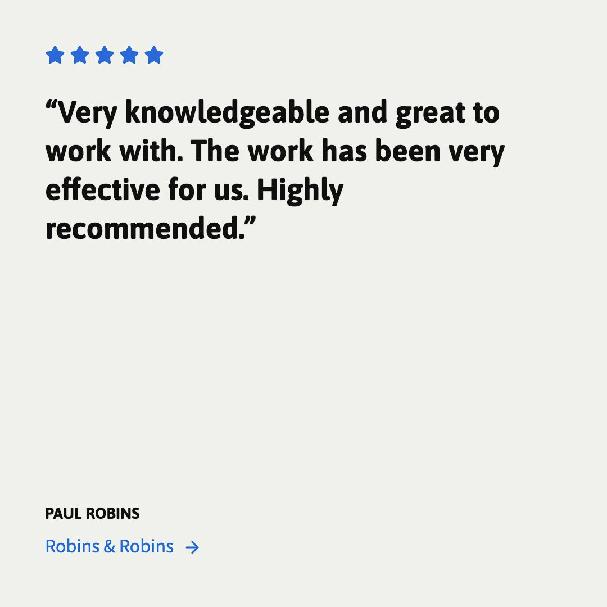
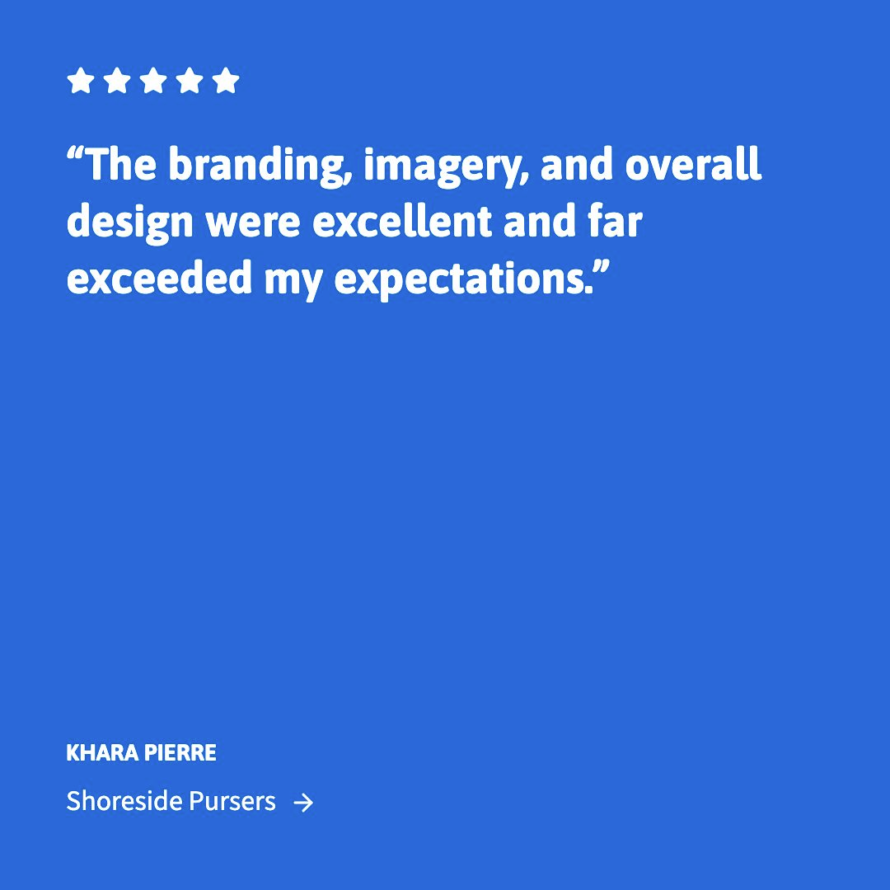

# Stormy Studios | Web Design Cornwall

**Confident design. Solid development.**

Stormy Studios is an independent web design and development studio in **Pelynt, near Looe, Cornwall**. We create bespoke websites, identities and digital products for businesses across Cornwall, Devon and the UK, backed by more than 25 years of website design and development experience.

Clear direction, considered design and dependable technical work, from the first conversation through to launch and ongoing care.

[Visit the website](https://stormystudios.com/) · [Explore the work](https://stormystudios.com/#work) · [Discuss a project](https://stormystudios.com/#contact)

## What We Do

| Design and direction | Development and delivery | Performance and ongoing care |
| --- | --- | --- |
| Website strategy and structure | Bespoke, responsive websites | Technical and on-site SEO |
| Brand identity and digital design | Custom content management systems | Accessibility and performance testing |
| Interface and product design | Ecommerce and Shopify development | Hosting, maintenance and website support |
| Clear content and user journeys | Web applications, portals and integrations | AI consulting and useful integrations |

Every project is shaped around the business and the people using it. The right CMS, platform and technical approach follow from the work, not the other way around.

## Selected Work

| Ware Commercial | Longstone IT | Crayon Architects |
| --- | --- | --- |
|  |  |  |
| Commercial property website | Brand identity and bespoke website | Content-managed architecture portfolio |

| Robins & Robins | Shoreside Pursers | IT Support Devon |
| --- | --- | --- |
|  |  |  |
| Targeted Shopify development and SEO | Design and website support | Brand identity and practical support content |

### In Progress

| Smash Em | Franklyn Robinson |
| --- | --- |
|  |  |
| Bespoke website and **custom CMS** for menus, specials and photography. Looe, Cornwall. Awaiting launch. | Brand identity, website and bespoke property platform. Rame, Cornwall. Work in progress. |

### Studio Ventures

| Stormy Studios | Bloxli | Varial | Soda |
| --- | --- | --- | --- |
|  |  |  |  |
| Our studio website | Lightweight website and identity | Brand and product development for a closed beta | A direct, distinctive SEO brand identity |

**[View the complete portfolio gallery](PORTFOLIO.md)** for desktop, tablet and mobile Safari views, the custom CMS and brand artwork.

## Client Feedback

Individual testimonial cards reproduced from [the Stormy Studios website](https://stormystudios.com/#testimonials), with the original wording and attribution.

| Ware Commercial | Longstone IT |
| --- | --- |
|  |  |

| Robins & Robins | Shoreside Pursers |
| --- | --- |
|  |  |

## How We Work

**Discover / Design / Build / Launch / Support**

Understand the business, agree the direction and carry it through with clear communication and careful delivery. Work directly with the studio, with local meetings when useful and a straightforward remote process for projects further afield.

Our own website's [published performance history](https://stormystudios.com/#performance) records dated mobile and desktop lab measurements. Accessibility, responsive behaviour and usability remain part of the standard, not a trade-off for a score.

## Start a Conversation

- **Website:** [stormystudios.com](https://stormystudios.com/)
- **Email:** [email@stormystudios.com](mailto:email@stormystudios.com)
- **Telephone:** [01503 492777](tel:+441503492777)
- **Based in:** Pelynt, near Looe, Cornwall, UK
- **Hours:** Monday to Friday, 09:00-17:00 UK time
- **Clutch:** [Stormy Studios profile](https://clutch.co/profile/stormy-studios)

Business founded in 2024. The 25+ years above refer to professional experience.

Portfolio images show Stormy Studios' work for the named organisations and its studio-owned ventures. Client marks and artwork remain the property of their respective owners; this gallery is not a reusable asset library.
